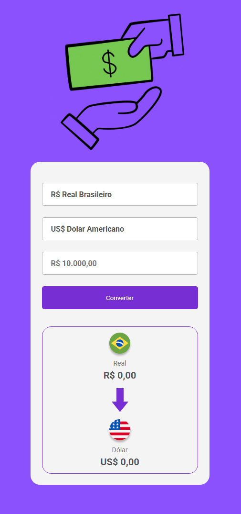

# Currency Converter — BRL to USD, EUR, GBP and Bitcoin

A web application that converts **Brazilian Real (BRL)** into **USD, EUR, GBP, and Bitcoin (BTC)** using real-time exchange rates.  
Built with a focus on API consumption, financial data handling, and clean user interface design.

---


<div align="center">
  
  ## Preview
  

</div>

---

## Features

- Convert:
  - BRL → USD  
  - BRL → EUR  
  - BRL → GBP  
  - BRL → Bitcoin  
- Real-time exchange rate data  
- Automatic currency formatting  
- Dynamic currency selection  
- Responsive and user-friendly interface  
- Structured for future expansion  

---

## Problem It Solves

People dealing with international purchases, travel, investments, or cryptocurrency often need quick currency comparisons. This application provides a fast and intuitive way to convert BRL into major global currencies and Bitcoin.

---

## Technologies Used

- **HTML5** — Structure  
- **CSS3** — Styling & layout  
- **JavaScript (Vanilla JS)** — Application logic  
- **ExchangeRate API** — Fiat currency data  
- **CoinGecko API** — Bitcoin price data  

---

## API Integration

The app fetches real-time fiat exchange rates:

```javascript
const response = await fetch(`https://v6.exchangerate-api.com/v6/YOUR_API_KEY/latest/BRL`);
const data = await response.json();
const rates = data.conversion_rates;
```

Bitcoin price data:

```javascript
const btcResponse = await fetch("https://api.coingecko.com/api/v3/simple/price?ids=bitcoin&vs_currencies=brl");
const btcData = await btcResponse.json();
```

---

## Project Structure

```
currency-converter
 ├── index.html
 ├── style.css
 ├── script.js
 └── assets/
```

---

## 🌐 Live Demo

 👉  https://victor-f-padua.github.io/Currency-converter/

## Project Goal

Practice:

- API consumption  
- Financial data manipulation  
- Front-end programming logic  
- Building functional user interfaces  

---

## Author

Victor Ferreira de Pádua  
Technology student focused on continuous growth through practical projects.
